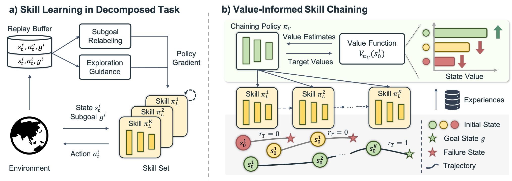

# ViSkill: Value-Informed Skill Chaining for Policy Learning of Long-Horizon Tasks with Surgical Robot
This is the official PyTorch implementation of the paper "**Value-Informed Skill Chaining for Policy Learning of Long-Horizon Tasks with Surgical Robot**". 
<!-- <p align="left">
  
</p> -->

# Prerequisites
* Ubuntu 18.04
* Python 3.7+


# Installation Instructions

1. Clone this repository.
```bash
git clone https://github.com/med-air/ViSkill.git
cd ViSkill
```

2. Create a virtual environment
```bash
conda create -n viskill python=3.8
conda activate viskill
```

3. Install packages

```bash
pip3 install -e SurRoL/	# install surrol environments
pip3 install -r requirements.txt
pip3 install -e .
```

4. Then add one line of code at the top of `gym/gym/envs/__init__.py` to register SurRoL tasks:

```python
# directory: anaconda3/envs/dex/lib/python3.8/site-packages/
import surrol.gym
```

# Usage
Commands for ViSkill. Results will be logged to WandB. Before running the commands below, please change the wandb entity in [```skill_learning.yaml```](viskill/configs/skill_learning.yaml#L32) and [```skill_chaining.yaml```](viskill/configs/skill_chaining.yaml#L39) to match your account.

We collect demonstration data for each subtask via the scripted controllers provided by SurRoL. Take the BiPegTransfer task as example:
```bash
mkdir SurRoL/surrol/data/demo
python SurRoL/surrol/data/data_generation_bipegtransfer.py --env BiPegTransfer-v0 --subtask grasp
python SurRoL/surrol/data/data_generation_bipegtransfer.py --env BiPegTransfer-v0 --subtask handover
python SurRoL/surrol/data/data_generation_bipegtransfer.py --env BiPegTransfer-v0 --subtask release
```
## Training Commands 

- Train subtask policies:
```bash
mpirun -np 8 python -m train_sl.py seed=1 subtask=grasp
mpirun -np 8 python -m train_sl.py seed=1 subtask=handover
mpirun -np 8 python -m train_sl.py seed=1 subtask=release
```

- Train chaining policies:
```bash
mpirun -np 8 python -m train_sc.py model_seed=1 task=BiPegTransfer-v0
```


# Starting to Modify the Code
## Modifying the hyperparameters
The default hyperparameters are defined in `viskill/configs`, where [```skill_learning.yaml```](viskill/configs/skill_learning.yaml) and [```skill_chaining.yaml```](viskill/configs/skill_chaining.yaml) define the experiment settings of learning subtask policies and chaining policies, respectively, and YAML file in the directory [```sl_agent```](viskill/configs/sl_agent) and [```sc_agent```](viskill/configs/sc_agent) define the hyperparameters of each method. Modifications to these parameters can be directly defined in the experiment or agent config files, or passed through the terminal command.

## Adding a new RL algorithm
The core RL algorithms are implemented within the `BaseAgent` class. For adding a new skill chaining algorithm, a new file needs to be created in
`viskill/agents` and [```BaseAgent```](viskill/agents/base.py#L8) needs to be subclassed. In particular, any required
networks (actor, critic etc) need to be constructed and the `update(...)` function and `get_action(...)` needs to be overwritten. When implementation is done, a registration is needed in [```factory.py```](viskill/agents/factory.py) and a config file should also be made in [```sc_agent```](viskill/configs/sc_agent) to specify the model parameters. 

# Code Navigation

```
viskill
  |- agents                # implements core algorithms in agent classes
  |- components            # reusable infrastructure for model training
  |    |- checkpointer.py  # handles saving + loading of model checkpoints
  |    |- environment.py   # environment wrappers for SurRoL environments
  |    |- normalizer.py    # normalizer for vectorized input
  |    |- logger.py        # implements core logging functionality using wandB
  |
  |- configs               # experiment configs 
  |    |- skill_learning.yaml   # configs for subtask policy learning
  |    |- skill_chaining.yaml   # configs for chaining policy learning
  |    |- sl_agent         # configs for demonstration-guided RL algorithm
  |    |- sc_agent         # configs for skill chaining algorithm
  |    |- hier_agent       # configs for (synthetic) hierachical agent
  |
  |- modules               # reusable architecture components
  |    |- critic.py        # basic critic implementations (eg MLP-based critic)
  |    |- distributions.py # pytorch distribution utils for density model
  |    |- policy.py    	   # basic actor implementations
  |    |- replay_buffer.py # her replay buffer with future sampling strategy
  |    |- sampler.py       # rollout sampler for collecting experience
  |    |- subnetworks.py   # basic networks
  |
  |- trainers              # main model training script, builds all components + runs training loop and logging
  |
  |- utils                 # general and rl utilities, pytorch / visualization utilities etc
  |- train_sl.py           # experiment launcher for skill learning
  |- train_sc.py           # experiment launcher for skill chaining
```

# Contact
For any questions, please feel free to email thuang22@cse.cuhk.edu.hk
